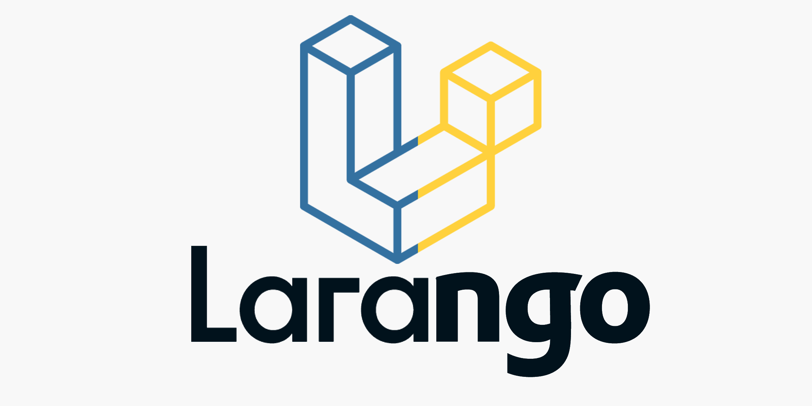

# Larango
It's a framework built on Django, It targets people from a slightly background with expertise and knowledge in PHP & Laravel in particular to help them build web applications without fully learning the Django.

It's still on working.
When finished, there will be a complete explanation of it's commands and features.

Credits
-------
* [Mosab Jbara](https://www.linkedin.com/in/mosab-jbara)